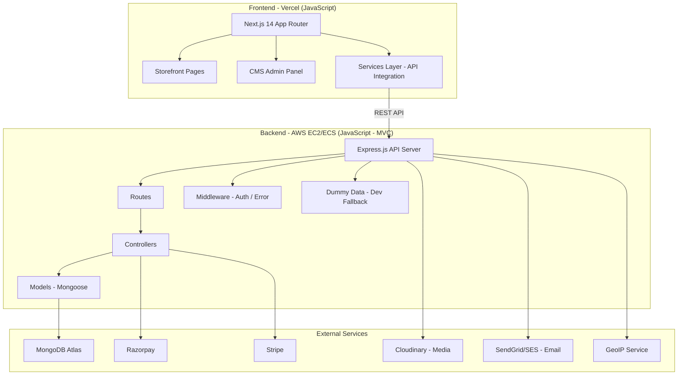
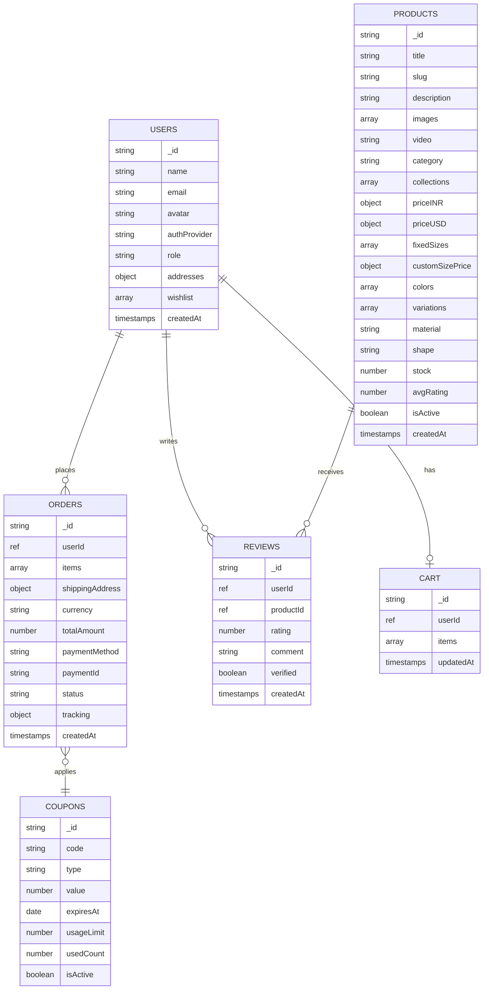

# LoomistryStudio.com — Software Requirements Specification (SRS)

## Implementation Plan

---

## Problem Statement

Build a complete e-commerce platform for selling handmade rugs and carpets, with a customer-facing storefront and an admin CMS panel. The platform must support international buyers with region-based pricing, multiple social auth providers, and dual payment gateways.

---

## Requirements

| Area | Requirement |
|------|-------------|
| Auth | Sign up/in via Google, Facebook, Twitter |
| Storefront | Home page with collections, categories, and filters (size, color, price, material, shape) |
| Product Detail | Title, description, images, video, sizes dropdown (fixed + custom), colors, variations, region pricing |
| Cart & Wishlist | Add to cart, wishlist/favourites, persist across sessions |
| Pricing | Auto-detect India (INR) vs International (USD) via IP, per-product dual pricing |
| Payments | Razorpay (India), Stripe (International) |
| Reviews | Star ratings + text reviews from verified buyers |
| Orders | Order tracking page, manual fulfillment with status updates |
| Coupons | Promo codes with percentage/flat discounts, expiry, usage limits |
| Notifications | Email for order confirmation, shipping updates, abandoned cart |
| Search | Autocomplete product search |
| CMS Panel | Product management (images, video via Cloudinary), dual pricing, inventory, orders, coupons, roles (Admin + Editor) |

---

## Tech Stack

| Layer | Technology |
|-------|-----------|
| Frontend | Next.js 14 (App Router) — **JavaScript** — deployed on Vercel |
| Backend | Node.js + Express — **JavaScript (MVC Pattern)** — deployed on AWS (EC2/ECS) |
| Database | MongoDB (Atlas) |
| Media Storage | Cloudinary (images + video with transformations) |
| Payments (India) | Razorpay |
| Payments (International) | Stripe |
| Auth | Passport.js (OAuth 2.0) with JWT |
| Email | SendGrid or AWS SES |
| GeoIP | ip-api or MaxMind |

---

## Project Structure

```
LoomistryStudio/
├── frontend/                  # Next.js 14 App (JavaScript)
│   ├── src/
│   │   ├── app/              # Next.js App Router pages
│   │   ├── components/       # UI Components
│   │   │   ├── home/         # Home page components
│   │   │   ├── product/      # Product components
│   │   │   └── layout/       # Header, Footer
│   │   └── services/         # API integration layer
│   │       ├── api.js        # Base fetch wrapper
│   │       ├── product.service.js
│   │       └── health.service.js
│   ├── package.json
│   └── next.config.js
│
├── backend/                   # Express.js API (MVC Pattern)
│   ├── src/
│   │   ├── config/           # App & DB configuration
│   │   ├── controllers/      # Request handlers (C)
│   │   ├── models/           # Mongoose schemas (M)
│   │   ├── routes/           # Route definitions
│   │   ├── middleware/       # Auth, error handling
│   │   ├── data/             # Dummy data for development
│   │   ├── utils/            # Helper functions
│   │   ├── app.js            # Express app setup
│   │   └── index.js          # Server entry point
│   ├── package.json
│   └── .env.example
│
└── LoomistryStudio-SRS.md    # This document
```

## Development Approach

| Principle | Description |
|-----------|-------------|
| **Language** | JavaScript only (no TypeScript) — both frontend and backend |
| **Backend Pattern** | MVC (Model-View-Controller) with Express.js |
| **Frontend-Backend Sync** | Frontend `services/` layer maps 1:1 to backend API endpoints |
| **Dummy Data** | Backend serves dummy product data when MongoDB is unavailable |
| **API-First** | Backend APIs are built first, frontend components consume them immediately |
| **Separate Folders** | `frontend/` and `backend/` are independent projects with own `package.json` |

---

## Architecture



---

## Database Schema (MongoDB Collections)



---

## User Roles

| Role | Permissions |
|------|------------|
| **Admin** | Full access — manage products, orders, coupons, users, settings, delete anything |
| **Editor** | Add/edit products, manage media, view orders — cannot delete products or manage users |
| **Buyer** | Browse, purchase, review, track orders |

---

## Key Features Detail

### Authentication
- Social OAuth via Google, Facebook, Twitter (X)
- JWT-based sessions with httpOnly cookies
- Refresh token rotation
- Protected routes for cart, checkout, orders, profile

### Product Management (CMS)
- Multi-image upload with drag-and-drop reorder
- Video upload with preview
- Dual pricing (INR + USD) per product and per size
- Fixed sizes with individual prices
- Custom size pricing (per sq ft in INR and USD)
- Category assignment
- Collection tagging (Bestsellers, New Arrivals, etc.)
- Color variants with swatches
- Material and shape attributes
- Rich text description editor
- Stock/inventory tracking
- Publish/unpublish toggle

### Regional Pricing
- Auto-detect user country via IP geolocation
- Show INR for Indian visitors, USD for international
- Per-product dual pricing set in CMS
- Currency symbol and formatting based on region

### Search & Filtering
- MongoDB text index search with autocomplete
- Filters: size, color, price range, material, shape
- Sort: price (low/high), newest, bestselling, rating
- URL-based filter state (shareable links)

### Payment Flow
- Auto-select gateway based on region (Razorpay for India, Stripe for international)
- Razorpay: create order → checkout modal → verify signature
- Stripe: create PaymentIntent → card form → confirm payment
- Webhook handlers for async payment events
- Order created on successful payment only

### Order Lifecycle
```
Confirmed → Processing → Shipped → Delivered
                ↓
            Cancelled
```
- Manual fulfillment by admin
- Tracking info (courier name, tracking number, URL)
- Status change triggers email notification to buyer

---

## Task Breakdown

---

### Task 1: Project Setup & Separate Frontend/Backend Structure

**Objective:** Initialize the project with separate `frontend/` (Next.js 14, JavaScript) and `backend/` (Express.js, JavaScript, MVC pattern) folders with API integration.

**Implementation:**
- Create `backend/` with MVC folder structure: `src/config`, `src/controllers`, `src/models`, `src/routes`, `src/middleware`, `src/utils`, `src/data`
- Create `frontend/` with Next.js 14 App Router (JavaScript, no TypeScript)
- Set up `frontend/src/services/` layer for API integration (maps 1:1 with backend endpoints)
- Configure ESLint for both projects
- Set up environment variables (.env.example for both)
- Set up MongoDB connection with Mongoose (graceful fallback to dummy data)
- Add dummy product data for development when DB is unavailable

**Test:** Verify both apps start locally, backend responds on `/api/health` and `/api/products`, frontend renders and fetches from backend

**Demo:** Backend running at localhost:5001/api/products returning 6 dummy products; Frontend at localhost:3000 displaying product grid fetched from the API

---

### Task 2: Authentication System (Social OAuth)

**Objective:** Implement social authentication with Google, Facebook, Twitter, and Apple using Passport.js with JWT sessions.

**Implementation:**
- Set up Passport.js strategies for Google, Facebook, Twitter, Apple OAuth
- Create User model (Mongoose) — name, email, avatar, authProvider, role, timestamps
- Implement JWT token generation and refresh token flow in `controllers/auth.controller.js`
- Build auth middleware (`middleware/auth.middleware.js`) for protected routes
- Create Next.js sign-up/sign-in pages with social login buttons
- Create `services/auth.service.js` on frontend for login/logout API calls
- Handle callback redirects and token storage (httpOnly cookies)
- Add user profile endpoint (GET /api/auth/me)

**Test:** Unit test token generation/validation, integration test OAuth callback flow with mocked providers

**Demo:** User can click "Sign in with Google", authenticate, and land on the home page as a logged-in user with their name/avatar visible

---

### Task 3: CMS Panel — Product Management (CRUD + Media Upload)

**Objective:** Build the CMS admin panel with full product CRUD and Cloudinary media upload for images and videos.

**Implementation:**
- Create Product model in MongoDB with all fields (title, slug, description, images[], video, category, collections[], priceINR, priceUSD, fixedSizes[], customSizePrice, colors[], variations[], material, shape, stock, isActive)
- Build Cloudinary integration service for image/video upload with transformations
- Create REST endpoints: POST/GET/PUT/DELETE `/api/admin/products`
- Build CMS UI: product list table, add/edit product form with:
  - Multi-image upload with drag-and-drop, reorder, delete
  - Video upload with preview
  - Dual pricing fields (INR + USD) for each fixed size
  - Custom size pricing (per sq ft in INR and USD)
  - Category, collections, colors, material, shape dropdowns
  - Rich text editor for description
- Add role-based access middleware (Admin: full access, Editor: add/edit only, no delete)
- Add image optimization on upload (auto-resize, WebP conversion via Cloudinary)

**Test:** API tests for product CRUD, verify image upload returns Cloudinary URL, test role-based access denial

**Demo:** Admin logs into CMS, creates a new rug product with 5 images + video, sets INR/USD pricing for 3 sizes, saves and sees it in the product list

---

### Task 4: Storefront — Home Page, Categories & Collections

**Objective:** Build the customer-facing home page with hero banner, bestsellers, categories, and collection grids.

**Implementation:**
- Create home page layout with: hero carousel/banner, bestseller section, category grid, "Shop the Look" section, deal of the week
- Build category pages with product grid (Hand Tufted, Persian, Abstract, etc.)
- Build collection pages (New Arrivals, Bestsellers, Living Room, etc.)
- Implement product card component (image, title, price, quick-add-to-cart, wishlist icon)
- Add responsive design (mobile-first approach)
- Implement SSG/ISR for category and collection pages for SEO and performance
- Add CMS fields for managing hero banners and featured sections

**Test:** Verify pages render with product data, test responsive breakpoints, verify SSG generates static pages

**Demo:** Home page loads with hero banner, shows 8 bestseller products in a grid, category cards link to filtered product pages

---

### Task 5: Product Detail Page with Variations & Regional Pricing

**Objective:** Build the product detail page with image gallery, size/color selection, custom size calculator, and auto-detected regional pricing.

**Implementation:**
- Integrate GeoIP detection (ip-api or MaxMind) to determine user country
- Build pricing utility: show INR for India, USD for all others, with currency symbol
- Create product detail page with:
  - Image gallery with zoom and thumbnails
  - Video player (if video exists)
  - Size dropdown (fixed sizes with prices) + custom size input with live price calculation
  - Color swatches
  - Variation selector
  - Price display based on detected region
  - "Add to Cart" and "Add to Wishlist" buttons
  - Product description (rich text rendered)
  - Related products section
- Add structured data (JSON-LD) for SEO
- Add breadcrumb navigation

**Test:** Test GeoIP detection mocking, verify price switches between INR/USD, test custom size price calculation

**Demo:** User opens a rug detail page, sees images with zoom, selects 5x7 ft size (price shows ₹8,999 for Indian IP), switches to custom size 6x9, sees calculated price update live

---

### Task 6: Product Search & Filtering

**Objective:** Implement autocomplete search and advanced product filtering on category/collection pages.

**Implementation:**
- Build search API with MongoDB text index (title, description, category, material)
- Implement autocomplete endpoint (returns top 5 suggestions as user types)
- Build search results page with product grid
- Add filter sidebar/panel on category pages:
  - Size filter (checkboxes)
  - Color filter (swatches)
  - Price range (slider or min/max input)
  - Material filter (checkboxes)
  - Shape filter (Rectangle, Round, Runner, etc.)
- Implement URL-based filter state (shareable filtered URLs)
- Add sort options: Price low-high, high-low, Newest, Bestselling, Rating
- Build search bar component with debounced autocomplete dropdown

**Test:** Test search returns relevant results, verify filters narrow down products correctly, test URL state persistence

**Demo:** User types "blue persian" in search bar, sees autocomplete suggestions, clicks one and lands on filtered results. On category page, applies color=Blue + size=5x7 filter and sees narrowed results

---

### Task 7: Cart & Wishlist

**Objective:** Build persistent shopping cart and wishlist functionality with session support for guests and syncing for logged-in users.

**Implementation:**
- Create Cart model (userId, items[{productId, size, color, quantity, isCustomSize, customDimensions}])
- Build cart API: add item, update quantity, remove item, get cart, clear cart
- Create Wishlist functionality (stored in User document)
- Build cart page UI: product list with images, size/color info, quantity controls, subtotal, total
- Build wishlist page UI: product grid with "Move to Cart" option
- Implement guest cart (localStorage) that syncs to DB on login
- Add cart icon with item count badge in header
- Handle stock validation on add-to-cart
- Show regional pricing in cart (INR or USD based on detection)

**Test:** Test add/remove/update cart operations, test guest-to-user cart merge, test stock validation

**Demo:** User adds 2 rugs to cart (different sizes), views cart with correct prices, removes one, adds another to wishlist, then moves it from wishlist to cart

---

### Task 8: Checkout & Payment Integration (Razorpay + Stripe)

**Objective:** Build the checkout flow with address collection, order summary, and dual payment gateway integration.

**Implementation:**
- Build checkout page: shipping address form (with saved addresses), order summary, coupon input
- Implement Razorpay integration for Indian customers:
  - Create Razorpay order on backend
  - Launch Razorpay checkout modal on frontend
  - Verify payment signature on backend
- Implement Stripe integration for international customers:
  - Create Stripe PaymentIntent on backend
  - Stripe Elements card form on frontend
  - Handle payment confirmation and webhooks
- Auto-select payment gateway based on detected region (Razorpay for IN, Stripe for others)
- Create Order model and save order on successful payment
- Handle payment failures and retries gracefully
- Generate order confirmation number
- Implement webhook handlers for async payment status updates

**Test:** Test Razorpay order creation and signature verification (test mode), test Stripe PaymentIntent flow (test mode), test order creation on success

**Demo:** Indian user checks out with Razorpay (test mode), sees Razorpay modal, completes payment, lands on order confirmation page. International user sees Stripe card form and completes payment.

---

### Task 9: Discount Coupons & Promotions

**Objective:** Build coupon system with creation in CMS and application at checkout.

**Implementation:**
- Create Coupon model (code, type[percentage/flat], value, minOrderAmount, maxDiscount, expiresAt, usageLimit, usedCount, applicableCategories, isActive)
- Build CMS UI for coupon management: create, edit, activate/deactivate, view usage stats
- Build coupon application API: validate code, check expiry, check usage limit, calculate discount
- Add coupon input field on checkout page with "Apply" button
- Show discount breakdown in order summary
- Increment usage count on successful order
- Handle edge cases: expired, already used, minimum order not met

**Test:** Test coupon validation (valid, expired, usage exceeded, min order), test discount calculation for percentage and flat types

**Demo:** Admin creates "WELCOME20" coupon (20% off, max ₹500), buyer applies it at checkout, sees discount reflected in total, places order successfully

---

### Task 10: Order Management & Tracking

**Objective:** Build order management in CMS and order tracking page for buyers.

**Implementation:**
- Build CMS order dashboard: list all orders with filters (status, date range, payment method)
- Order detail view in CMS: customer info, items, payment info, status update controls
- Implement order status flow: Confirmed → Processing → Shipped → Delivered (or Cancelled)
- Add manual tracking info fields (courier name, tracking number, tracking URL)
- Build buyer-facing "My Orders" page with order history
- Build order detail page for buyer: items, status timeline, tracking info
- Add status change notifications (trigger email on each status update)

**Test:** Test order status transitions, verify status update triggers email notification, test buyer can view their orders only

**Demo:** Admin updates order status to "Shipped" with tracking number in CMS, buyer sees updated status with tracking info on their order page

---

### Task 11: Product Reviews & Ratings

**Objective:** Implement verified buyer reviews with star ratings on product pages.

**Implementation:**
- Create Review model (userId, productId, rating, comment, verified, createdAt)
- Build review API: create review (only if user purchased product), get reviews for product (paginated)
- Calculate and update average rating on product document
- Build review UI on product detail page: rating summary, review list, "Write a Review" form
- Add review moderation in CMS (approve, hide, delete)
- Show "Verified Purchase" badge on reviews from actual buyers
- Add sort options for reviews (newest, highest rated, lowest rated)

**Test:** Test only buyers who purchased can review, test average rating calculation, test moderation hides review

**Demo:** User who purchased a rug writes a 5-star review with comment, it shows on the product page with "Verified Purchase" badge, admin can see it in CMS moderation queue

---

### Task 12: Email Notifications & Abandoned Cart

**Objective:** Implement transactional emails for order lifecycle and abandoned cart recovery.

**Implementation:**
- Set up email service (SendGrid or AWS SES)
- Create email templates (HTML): order confirmation, order shipped, order delivered, abandoned cart reminder
- Implement triggered emails:
  - On order placed: confirmation email with order details
  - On status change to Shipped: shipping notification with tracking
  - On status change to Delivered: delivery confirmation + review prompt
- Implement abandoned cart detection: cron job checks carts inactive for 24hrs (logged-in users)
- Send abandoned cart email with cart contents and "Complete Purchase" link
- Add email preference settings for users (opt-out option)
- Build CMS section to view email logs/stats

**Test:** Test email triggers on order events (mock email service), test abandoned cart detection logic, verify email template renders correctly

**Demo:** User places order → receives confirmation email. Admin marks shipped → user gets shipping email. Cart abandoned for 24hrs → recovery email sent with cart contents.

---

### Task 13: SEO, Performance & Security Hardening

**Objective:** Optimize for search engines, performance, and security best practices.

**Implementation:**
- SEO: meta tags, Open Graph, JSON-LD structured data for products, sitemap.xml, robots.txt
- Performance: Next.js Image optimization, lazy loading, code splitting, Cloudinary responsive images
- Add rate limiting on API endpoints
- Implement CSRF protection
- Add input validation and sanitization (express-validator)
- Set up CORS properly for production
- Add helmet.js for HTTP security headers
- Implement MongoDB query protection (injection prevention)
- Set up error logging (Sentry or similar)
- Add loading skeletons and optimistic UI updates
- Implement 404 and error pages

**Test:** Run Lighthouse audit (target 90+ scores), verify rate limiting blocks excessive requests, verify XSS inputs are sanitized

**Demo:** Lighthouse scores 90+ on mobile for home page, product page loads in under 2s, security headers present in response

---

### Task 14: Deployment & Production Setup

**Objective:** Deploy the complete application to production with CI/CD pipeline.

**Implementation:**
- Deploy Next.js frontend to Vercel (connect Git repo, configure environment variables)
- Deploy Node.js backend to AWS (EC2 or ECS with Docker)
- Set up MongoDB Atlas production cluster with proper indexing
- Configure Cloudinary production account
- Set up custom domain (loomistry studio.com) with SSL
- Configure DNS, Vercel domain settings
- Set up CI/CD: GitHub Actions for lint, test, build, deploy on push to main
- Set up environment-specific configs (dev, staging, production)
- Configure production Razorpay and Stripe keys
- Set up monitoring and alerting (uptime checks, error alerts)
- Database backup strategy (MongoDB Atlas automated backups)
- Add health check endpoints for monitoring

**Test:** Verify full user flow in production (sign up → browse → add to cart → checkout → order), verify SSL, verify backups configured

**Demo:** Full site live at LoomistryStudio.com, user can complete end-to-end purchase flow, CMS accessible to admin at /admin

---

## Timeline Estimate

| Phase | Tasks | Duration |
|-------|-------|----------|
| Foundation | Tasks 1-2 | Weeks 1-2 |
| CMS & Products | Tasks 3-4 | Weeks 3-5 |
| Shopping Experience | Tasks 5-7 | Weeks 6-8 |
| Payments & Orders | Tasks 8-10 | Weeks 9-11 |
| Engagement Features | Tasks 11-12 | Weeks 12-13 |
| Polish & Launch | Tasks 13-14 | Weeks 14-16 |

**Total: ~14-16 weeks for full feature launch**

---

## API Endpoints Overview

### Auth
| Method | Endpoint | Description |
|--------|----------|-------------|
| GET | `/api/auth/google` | Initiate Google OAuth |
| GET | `/api/auth/google/callback` | Google OAuth callback |
| GET | `/api/auth/facebook` | Initiate Facebook OAuth |
| GET | `/api/auth/facebook/callback` | Facebook OAuth callback |
| GET | `/api/auth/twitter` | Initiate Twitter OAuth |
| GET | `/api/auth/apple` | Initiate Apple OAuth |
| GET | `/api/auth/me` | Get current user profile |
| POST | `/api/auth/refresh` | Refresh access token |
| POST | `/api/auth/logout` | Logout user |

### Products
| Method | Endpoint | Description |
|--------|----------|-------------|
| GET | `/api/products` | List products (with filters, pagination) |
| GET | `/api/products/:slug` | Get product detail |
| GET | `/api/products/search` | Search with autocomplete |
| GET | `/api/categories` | List all categories |
| GET | `/api/collections` | List all collections |

### Cart
| Method | Endpoint | Description |
|--------|----------|-------------|
| GET | `/api/cart` | Get user's cart |
| POST | `/api/cart/add` | Add item to cart |
| PUT | `/api/cart/update` | Update item quantity |
| DELETE | `/api/cart/remove/:itemId` | Remove item from cart |

### Wishlist
| Method | Endpoint | Description |
|--------|----------|-------------|
| GET | `/api/wishlist` | Get user's wishlist |
| POST | `/api/wishlist/add` | Add product to wishlist |
| DELETE | `/api/wishlist/remove/:productId` | Remove from wishlist |

### Orders
| Method | Endpoint | Description |
|--------|----------|-------------|
| POST | `/api/orders/create` | Create order after payment |
| GET | `/api/orders` | Get user's orders |
| GET | `/api/orders/:id` | Get order detail |

### Payments
| Method | Endpoint | Description |
|--------|----------|-------------|
| POST | `/api/payments/razorpay/create` | Create Razorpay order |
| POST | `/api/payments/razorpay/verify` | Verify Razorpay payment |
| POST | `/api/payments/stripe/create-intent` | Create Stripe PaymentIntent |
| POST | `/api/payments/stripe/webhook` | Stripe webhook handler |

### Reviews
| Method | Endpoint | Description |
|--------|----------|-------------|
| GET | `/api/reviews/:productId` | Get product reviews |
| POST | `/api/reviews` | Create a review |

### Coupons
| Method | Endpoint | Description |
|--------|----------|-------------|
| POST | `/api/coupons/validate` | Validate and apply coupon |

### Admin (CMS)
| Method | Endpoint | Description |
|--------|----------|-------------|
| POST | `/api/admin/products` | Create product |
| PUT | `/api/admin/products/:id` | Update product |
| DELETE | `/api/admin/products/:id` | Delete product |
| GET | `/api/admin/orders` | List all orders |
| PUT | `/api/admin/orders/:id/status` | Update order status |
| POST | `/api/admin/coupons` | Create coupon |
| PUT | `/api/admin/coupons/:id` | Update coupon |
| GET | `/api/admin/reviews` | List reviews for moderation |
| PUT | `/api/admin/reviews/:id` | Moderate review |
| POST | `/api/admin/upload` | Upload media to Cloudinary |

---

## Reference

- **Reference Site:** [anywaycarpet.com](https://anywaycarpet.com)
- **Domain:** LoomistryStudio.com
- **Business:** Handmade rugs and carpets (Indian artisan craftsmanship)
- **Target Market:** India + International
